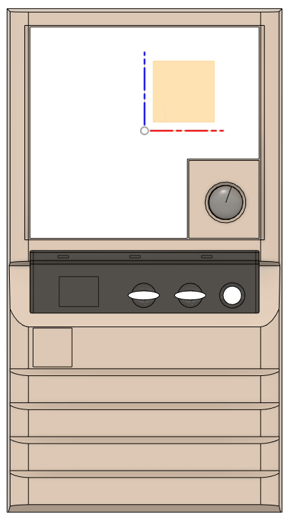
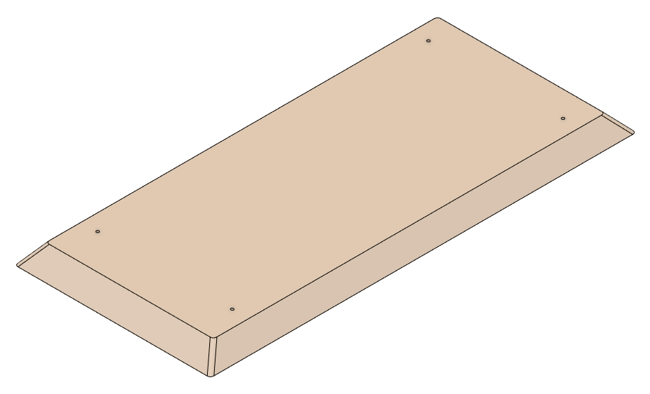
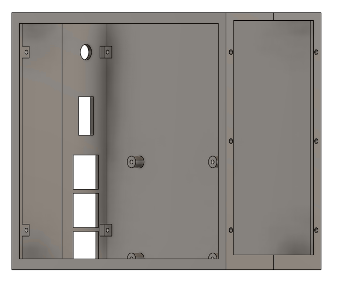
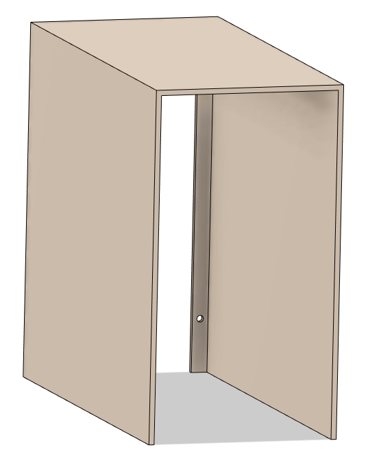
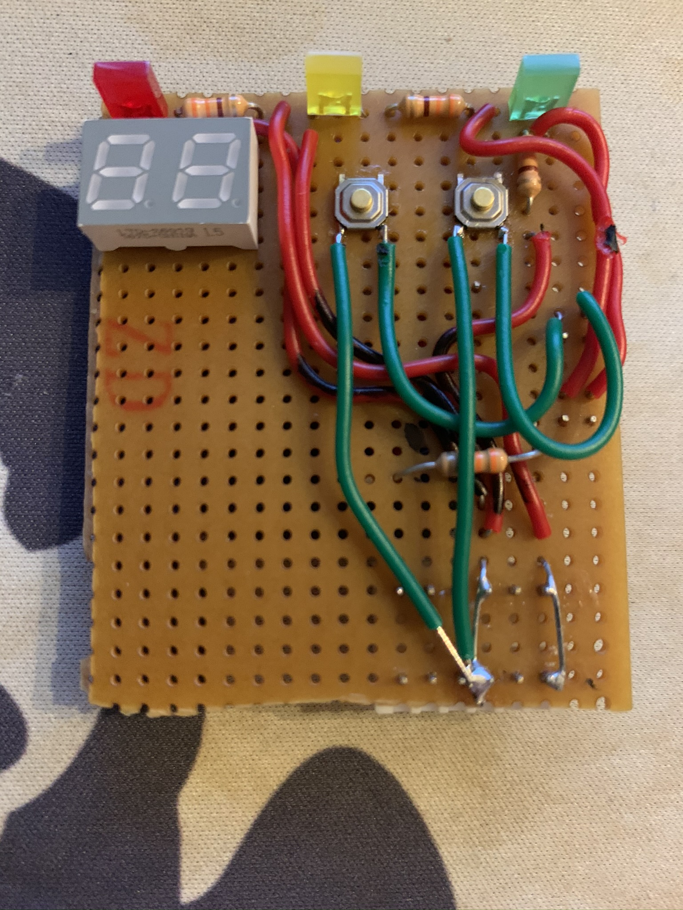
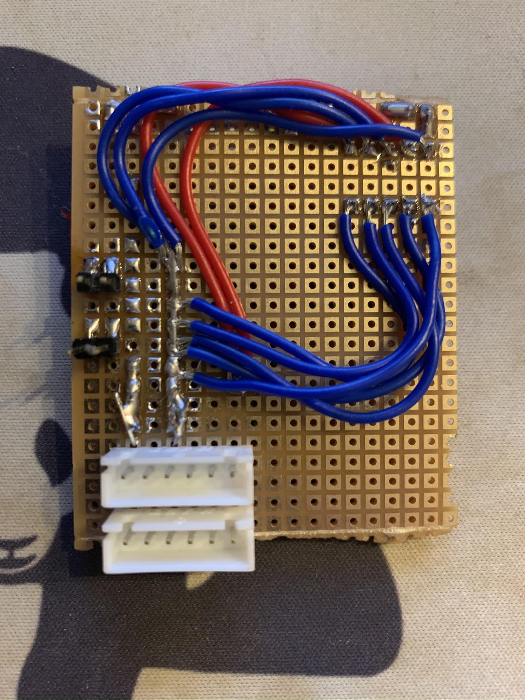
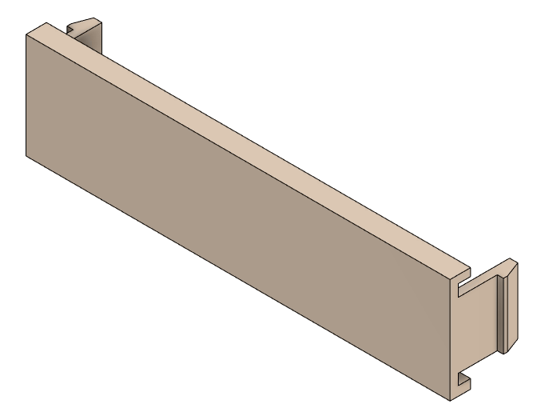
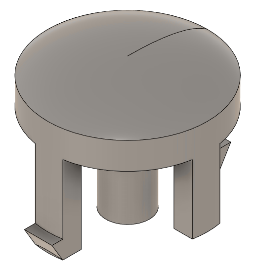

# KS-330 Mini

This project aims to provide CAD drawings and material to a faithful reproduction of one of the most iconic computer
cases from the early 1990s, the [MACASE DIAMOND
KS-330](https://web.archive.org/web/19980502082047/http://macase.com/product/personal/ks-330.htm). Ultimately the goal is to provide a set of suitable 3D Printed models to create a general purpose
miniature sized KS-330 case for a Raspberry Pi,
[MiSTer](https://github.com/MiSTer-devel/Main_MiSTer/wiki) and similar systems which will provide
compatibility with MS-DOS retro games.

Models are reproduction based on measures from an original case. The focus is primarily on visual
details. Areas which are not visible or clearly a result from practicality around the original
injection molds might not be accurately reproduced.

Please report any suggestions or issues using the GitHub issue tracker.

## List of manufacturers

The following OEM manufacturers have been identified to use the KS-330 or equivalent clones or versions in their
PC production in the early 1990s:

* Executive (clone?) (Italy?)
* TCi Computer AS (Bergen, Norway)

## Licensing

  3D Models, CAD files and renders are licensed under a <a rel="license"
href="http://creativecommons.org/licenses/by-nc-sa/4.0/">Creative Commons
Attribution-NonCommercial-ShareAlike 4.0 International License</a>.

## Components

### Full Size

The components in the main STL-directory is full size replicas of the original KS-330 case. There
are minor modifications done to improve slicer stability when scaled down.

The following components have been recreated in full size.

| KS-330-Front | Full Progress |
|--------------|---------------|
|   |   |

**Progress:** Work in progress, tested in 40% scale. `Front` is pretty accurate, but missing various
screw hole mounts on  the back side. Edges are not rounded.

| KS-330-IO-Panel-Overlay |
|-----------------|
| 
|

**Progress:** Work in progress, tested in full scale. `IO-Panel-Overlay` is pretty much complete,
but missing holes to clip onto the `IO-Panel`. Edges are not rounded.

| KS-330-Base-Plate |
|-----------------|
|  |

**Progress:** Completed and tested in 40% scale. Bottom is missing arrow marking to define front.

### Mini

This folder contains models speficially adjusted for a 1:2.5 (40%) size reduction which makes the
case comparable in size to the commercially released Mini and Classic consoles. Currently there
exists a case frame with support for Rasbperry Pi SoC motherboards. Other versions are planned in
the future.

The model uses M2.5 screws, only a few holes are actually threaded. Most of them are dependent on
nuts and bolts.

**Note!** Models not listed here are not yet converted to a `mini`-version. You may recreate them with decent
success by scaling down the full size models to 40%. 

| KS-330-Mini-Frame |
|-----------------|
|  |

The inner `frame` of the case. Split into two different STLs to improve 3D printability. Screw holes
in front is intended to fasten the front panel as well as future drive bay accessory and fan
assemblies. There are screw holes in the back to fasten the `sleeve` and holes in bottom to fasten
the `base plate`. The right and the left parts can optionally be glued together.

**Progress:** Completed, currently *untested*

| KS-330-Mini-Sleeve |
|-----------------|
|  |

The outer `sleeve` is intended to go on top of the inner `frame` and align with the front panel, just as the
original case.

**Progress:** Completed, currently *untested*. Edges are not rouned.

| KS-330-IO-Panel |
|-----------------|
|  |

Customized version of the IO Panel.

LED holes are completly open to account for non-transparent
material and widened to support 2mmx5mm square LEDs. The original case uses red for HDD, yellow for
Turbo and green for Power.

The Clock Speed indicator is altered to fit [0.28" 2-digit 7-segment
displays](https://www.digikey.com/products/en?keywords=DISPLAY%207SEG%200.28%22%20DBL%20). It is important to select a
version `common anode` or `common cathode` that fits your needs. You also need some logic to drive it as
most two digits are sharing the 8 control pins pins (two identical numbers can easily be hardwired).
Controller boards based on the [HT16K33](https://www.adafruit.com/product/1427) currently looks like
the most promising option.

**Progress:** The following remains: Button fitting and alignment. Creating a suitable BOM-list for
electronics. General model alignment (including rounded corners and model thickness).

| KS-330-IO-Panel-Circuit (Prototype) | |
|-----------------|-|
|  |  |

Prototype board (~50x50mm) with HDD and Turbo LEDs as well as turbo and reset buttons wired to
Mini-PV (Dupont)  connectors. JST-XH connectors are used for 5V power in/out. 7SEG is hardwired to
88. All leds are paired with 330ohm resistors.

**Progress:** Under development.

### Clone

The clone directory contains models based on measurements from a clone system. Quality is low
compared to the original KS-330 cases and models have fitment issues also found persisted in the
original clone parts.

| Clone-Bay-Cover-3.5 | Clone-Bay-Cover-5.25 |
|---------------|---------------|
|  | No picture |

Drive Bay Covers for 3.5" and 5.25" bays. Works with `KS-330-Front-Panel`. Fitment of the clone covers are
not 100%, but it is possible to adjust this with a precision knife without degrading quality. 

**Progress:** Completed, tested in full scale. 

| Clone-Power-Button |
|-----------------|
|  |

Power Button. Works with `KS-330-Front-Panel` but is not an accurate representation of the original
power button. Requires a low tension compression spring (Outer Ø=8mm, Inner Ø=7mm L=18mm Closed,
Squared and Ground) to work as intended.

**Progress:** Completed, tested in full scale. 