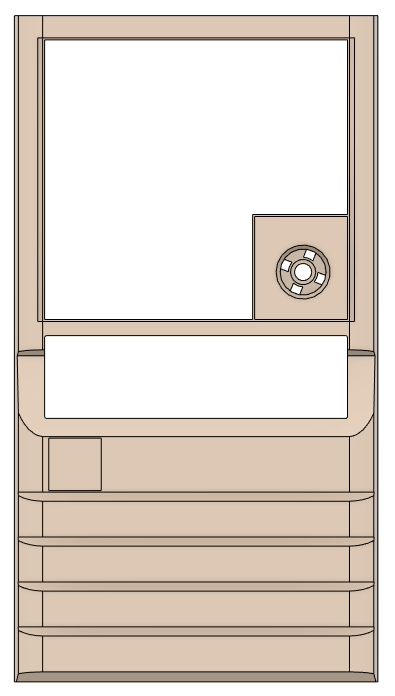
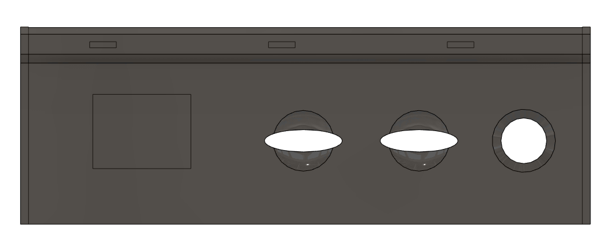

# KS-330 Mini

This project aims to provide CAD drawings and material to a faithful reproduction of one of the most iconic computer
cases from the early 1990s, the [MACASE DIAMOND
KS-330](https://web.archive.org/web/19980502082047/http://macase.com/product/personal/ks-330.htm). Ultimately the goal is to provide a set of suitable 3D Printed models to create a general purpose
miniature sized KS-330 case for a Raspberry Pi,
[MiSTer](https://github.com/MiSTer-devel/Main_MiSTer/wiki) and similar systems which will provide
compatibility with MS-DOS retro games.

Models are reproduction based on measures from an original case. The focus is primarily on visual
details. Areas which are not visible or clearly a result from practicality around the original
injection molds might not be accurately reproduced.

Please report any suggestions or issues using the GitHub issue tracker.

## Licensing

  3D Models, CAD files and renders are licensed under a <a rel="license"
href="http://creativecommons.org/licenses/by-nc-sa/4.0/">Creative Commons
Attribution-NonCommercial-ShareAlike 4.0 International License</a>.

## Components

### Front Panel

The main front panel consists of the main panel/bezel, power button and covers for the 3.5" and 5.25"
drive bays.

`ks-330-front`

### IO Panel

The IO panel consts of control buttons and a two or three digit 8 segment display. In addition to
electronics, this panel consts of three models.

`ks-330-io-panel` is the base structure for buttons and MHz-display. This part is mounted to the
case. A dark plexi overlay

`ks-330-io-panel-overlay` is a dark plexy overlay and responsible for the unique look and field.

`ks-330-io-panel-button` arehe used for the reset and turbo buttons.

## List of manufacturers

The following OEM manufacturers have been identified to use the KS-330 or equivalent clones or versions in their
PC production in the early 1990s:

* Executive (clone?) (Italy?)
* TCi Computer AS (Bergen, Norway)
