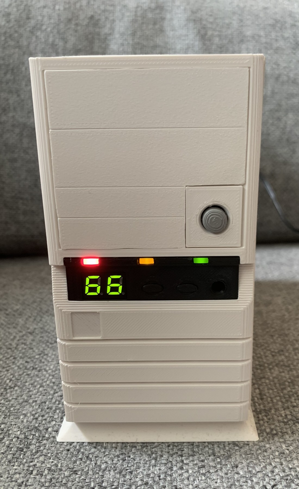
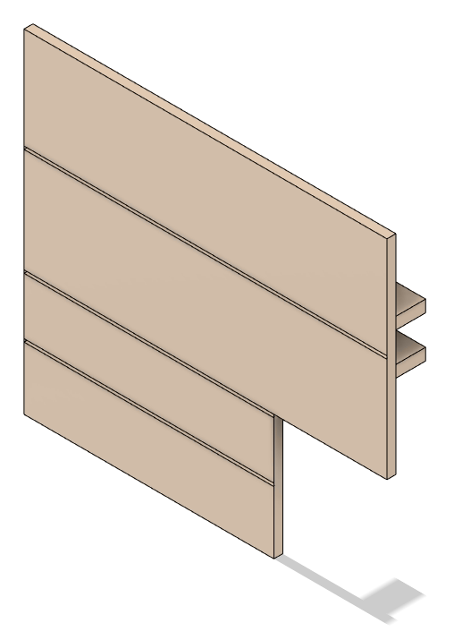
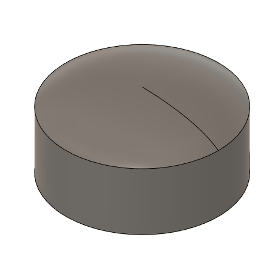
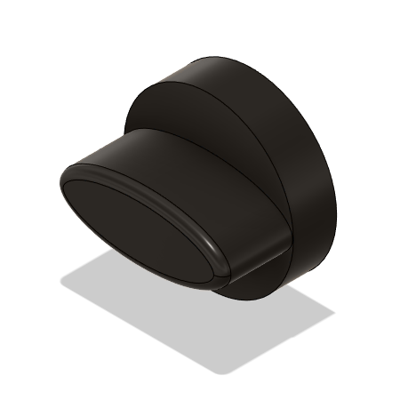
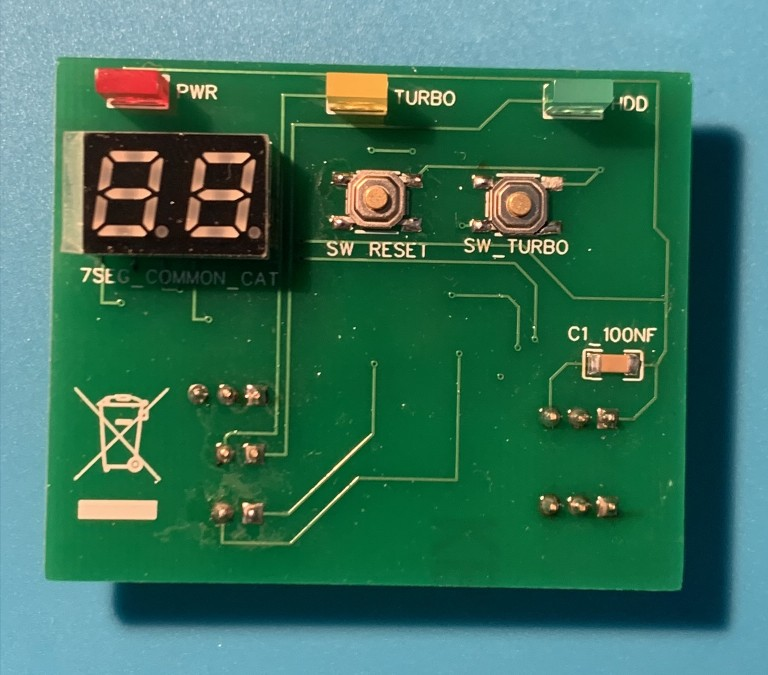
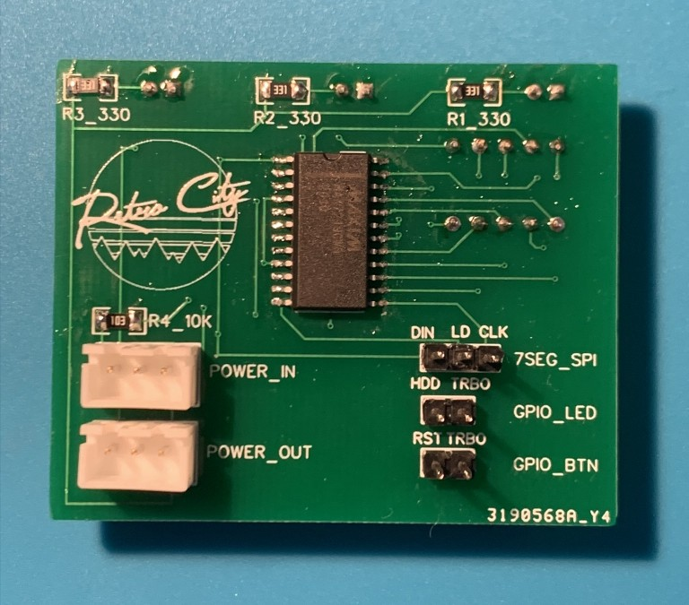

# KS-330 Mini

This project aims to provide CAD drawings and material to a faithful reproduction of one of the most iconic computer
cases from the early 1990s, the [MACASE DIAMOND
KS-330](https://web.archive.org/web/19980502082047/http://macase.com/product/personal/ks-330.htm). Ultimately the goal is to provide a set of suitable 3D Printed models to create a general purpose
miniature sized KS-330 case for a Raspberry Pi,
[MiSTer](https://github.com/MiSTer-devel/Main_MiSTer/wiki) and similar systems which will provide
compatibility with MS-DOS retro games.

Models are reproduction based on measures from an original case. The focus is primarily on visual
details. Areas which are not visible or clearly a result from practicality around the original
injection molds might not be accurately reproduced.

Please report any suggestions or issues using the GitHub issue tracker.
Interested in purchasing ready-to-use products? Contact <a href="mailto:sales@retrocity.no">sales@retrocity.no</>.

## List of manufacturers

The following manufacturers have been identified to use the KS-330 or equivalent clones or versions in their
PC production in the early 1990s:

* Executive (unoriginal case) (Italy)
* Cardinal Computer (Cookeville, TN, USA)
* TCi Computer AS (Bergen, Norway)

## Licensing

  3D Models, CAD files and renders are licensed under the <a rel="license"
href="http://creativecommons.org/licenses/by-nc-sa/4.0/">Creative Commons
Attribution-NonCommercial-ShareAlike 4.0 International License</a>.
  
 
All programs and scripts related to this project is licensed under the <a rel="license" href="https://www.gnu.org/licenses/gpl-3.0.en.html">GNU General Public License v3</a> unless otherwise is specifically stated.

## Components

### KS-330 Mini

 This folder contains models speficially  adjusted for a 1:2.5 (40%) size reduction which
makes the case comparable in size to the commercially released Mini and Classic consoles. Currently there
exists a case frame with support for Rasbperry Pi SoC motherboards. Other versions are planned in
the future.

The model uses M2.5 screws in a mix of 6mm and 8mm lengths. Some holes are threaded, but should
be secured with washers and nuts where possible.

**Note!** As of `beta3` we have an increased focus on keeping the parts bacwards compatible. It is
now possible to recreate a complete case with great looks and authenticity. The IO panel is still
work in progress. General fitment/assembly will be improved in future revisions.
 
 

| Front | Drive-Bay-Plain | Power-Button
|--------------|---------------|---------------|
|   |   |   |

Front panel with hole for push button ([Judco
40-4526-00](https://www.digikey.no/product-detail/no/judco-manufacturing-inc/40-4526-00/545PB-ND/1277805))
and

**Progress:** Completed in beta3. Future revision will focus on better/more durable screw hole
positioning. Possible adjustments to IO-Panel area. More drive bay inserts will be added in the future.

| Frame |
|-----------------|
|  |

The inner `frame` of the case. Split into two different STLs to improve 3D printability. Screw holes
in front is intended to fasten the front panel as well as future drive bay accessory and fan
assemblies. There are screw holes in the back to fasten the `sleeve` and holes in bottom to fasten
the `base plate`. The right and the left parts can optionally be glued together.

**Progress:** Completed in beta3. Future revisions will focus on case fitment and
screw hole. Looking into using some kind of panel mount standard for IO holes.

| Sleeve |
|-----------------|
|  |

The outer `sleeve` is intended to go on top of the inner `frame` and align with the front panel, just as the
original case.

**Progress:** Completed in beta3. Edges on top has to be rounded in future revision.

| IO-Panel | IO-Panel-Button
|-----------------|-----------------|
|  |  |

Customized version of the IO Panel.

LED holes are completly open to account for non-transparent
material and widened to support 2mmx5mm square LEDs. The original case uses red for HDD, yellow for
Turbo and green for Power.

The Clock Speed indicator is altered to fit [0.28" 2-digit 7-segment
displays](https://lcsc.com/product-detail/Led-Segment-Display_SUNLIGHT-SLR0282BH2C1BD-6-6_C225881.html). The
`common cathode` versions are the best as these work better with LED drivers. Green is the color
versions that closest matches the original. Our choice of LED driver fell on
MAX7219CWG+T due to a good combination of price, availability and ease of use. A poor man's option
is to just hard wire the LEDs. But then you're stuck with two identical numbers

**Progress:** Completed in beta3.

| IO-Panel-PCB | | IO-Panel-PCB (early prototype) | |
|-----------------|-|-|-|
|  |  |  |  |

Initial revision of the PCB with Power HDD and Turbo LEDs. HDD and Turbo LEDs as well as Reset and
Turbo buttons are controlled via GPIO (buttons are wired from GPIO to Ground for the simplest
possible circuitry). 7SEG is controlled through MAX7219 controller. GPIO uses Mini-PV (Dupont) connectors. JST-XH connectors are used for 5V power in/out. 

**Progress:** Completed in beta3.

### Full Size

The components in the main STL-directory is full size replicas of the original KS-330 case. There
are minor modifications done to improve slicer stability when scaled down.

The following components have been recreated in full size.

| KS-330-Front | Full Progress |
|--------------|---------------|
|   |   |

**Progress:** Work in progress, tested in 40% scale. `Front` is pretty accurate, but missing various
screw hole mounts on  the back side. Edges are not rounded.

| KS-330-IO-Panel-Overlay |
|-----------------|
| 
|

**Progress:** Work in progress, tested in full scale. `IO-Panel-Overlay` is pretty much complete,
but missing holes to clip onto the `IO-Panel`. Edges are not rounded.

| KS-330-Base-Plate |
|-----------------|
|  |

**Progress:** Completed and tested in 40% scale. Bottom is missing arrow marking to define front.

### Clone

The clone directory contains models based on measurements from a clone system. Quality is low
compared to the original KS-330 cases and models have fitment issues also found persisted in the
original clone parts.

| Clone-Bay-Cover-3.5 | Clone-Bay-Cover-5.25 |
|---------------|---------------|
|  | No picture |

Drive Bay Covers for 3.5" and 5.25" bays. Works with `KS-330-Front-Panel`. Fitment of the clone covers are
not 100%, but it is possible to adjust this with a precision knife without degrading quality. 

**Progress:** Completed, tested in full scale. 

| Clone-Power-Button |
|-----------------|
|  |

Power Button. Works with `KS-330-Front-Panel` but is not an accurate representation of the original
power button. Requires a low tension compression spring (Outer Ø=8mm, Inner Ø=7mm L=18mm Closed,
Squared and Ground) to work as intended.

**Progress:** Completed, tested in full scale. 
